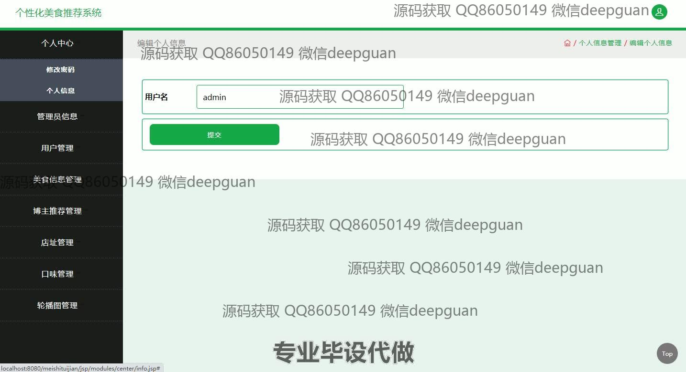
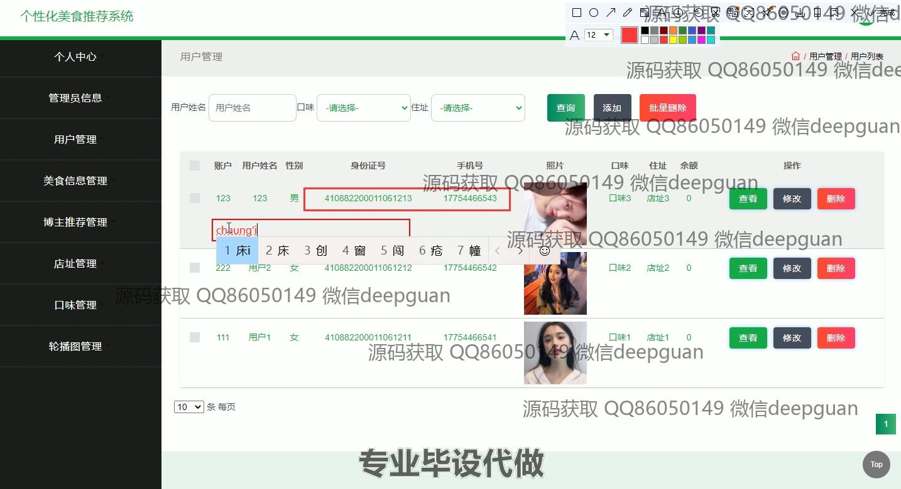

<h1 align="center">个性化美食推荐系统</h1>

## 简介
个性化美食推荐系统：角色分为管理员、用户；提供个人中心、用户管理、美食信息管理、博主推荐、美食推荐及留言互动等功能。界面设计简洁，提升用户体验。    --计算机毕业设计源码；毕设源码；java毕业设计源码

## 联系方式

<h3 align="center">获取完整代码与数据库文件 + 微信：deepguan QQ: 86050149 QQ群: 783742310</h3>

<h3 align="center">可帮忙远程部署 包运行成功！提供远程部署、修改代码、设计文档指导、代码讲解等服务！</h3>

## 功能介绍（完整见运行截图）
管理员：基本功能包括登录、注册、退出，以及管理用户、管理员信息、店铺、美食信息、口味、轮播图和留言等内容。管理员可以查看、添加、修改或删除用户信息，批量管理留言，上传文件，编辑内容详情，设置页面显示条目数量，灵活维护系统功能和数据。

用户：支持登录、注册、退出功能，提供个性化的美食推荐，用户可以查看美食详情、预定美食、浏览推荐美食列表。用户可在个人中心更新信息，包括头像、身份证号、手机号、余额、地址、口味偏好等，还能通过留言框提交评价与系统互动。

访客：访问首页可浏览推荐美食、博主推荐和美食详情。通过导航栏快速切换不同模块，获取美食信息及分类推荐，提供简洁美观的界面交互体验。

美食管理：展示美食的图像、价格、口味、地址和点击率，支持新增、编辑和上传美食信息，提供快捷的表单提交功能，管理员和用户可高效完成美食内容的维护和操作。

## 运行截图

本代码来源于网络,仅供学习参考使用!

